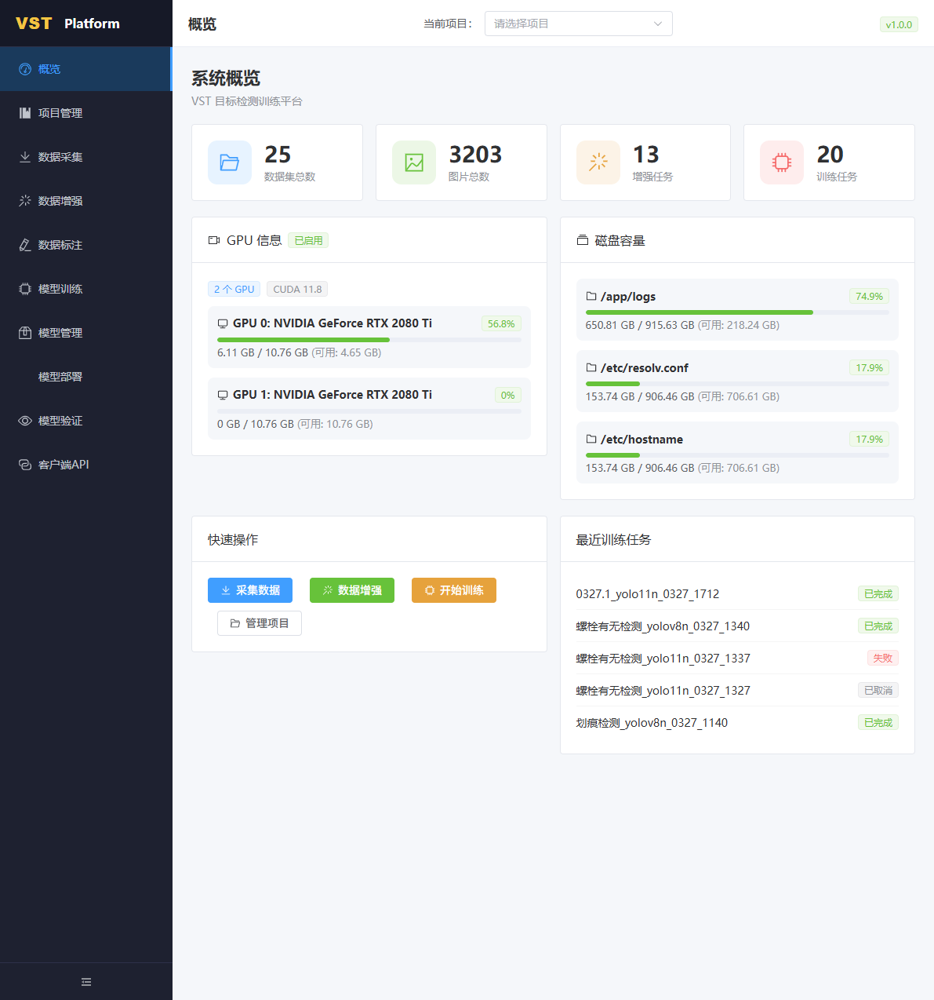
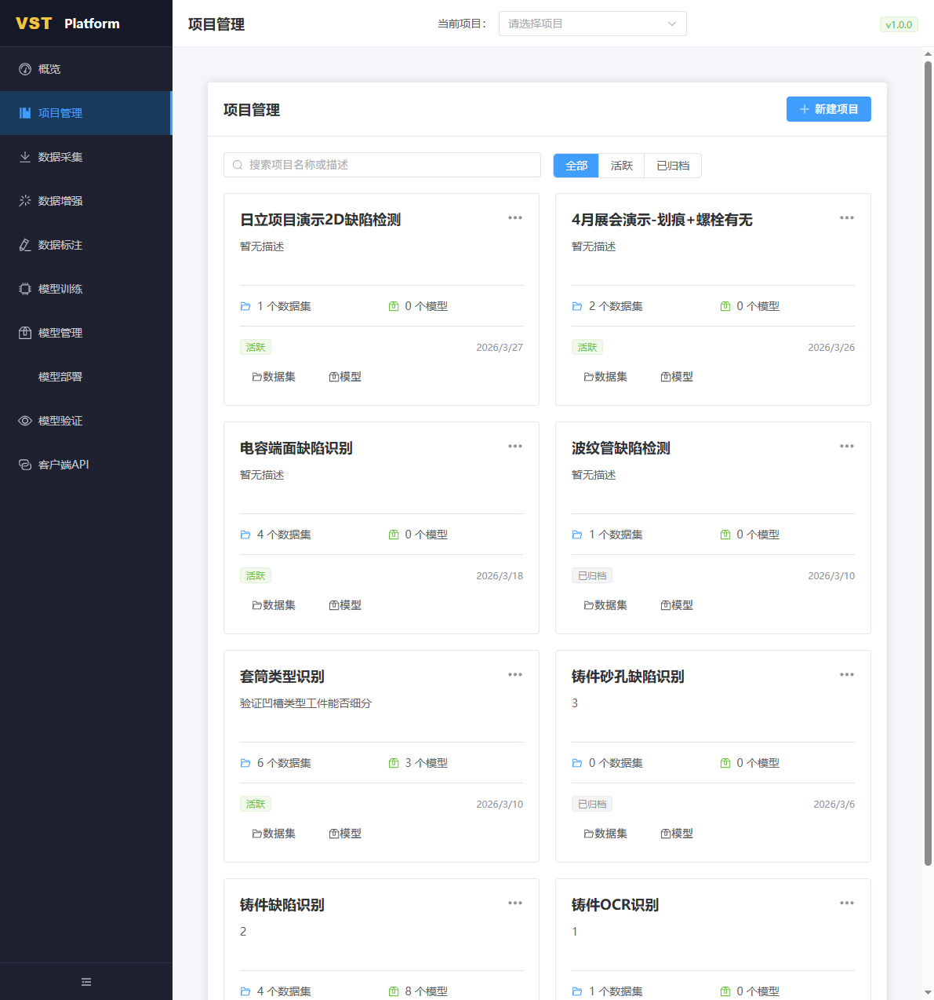
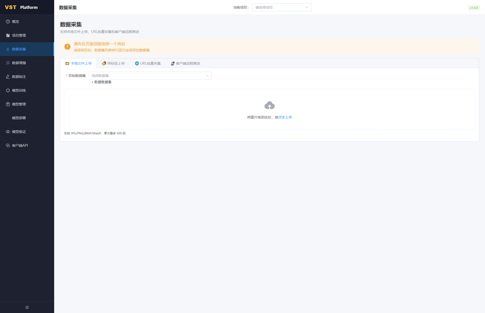
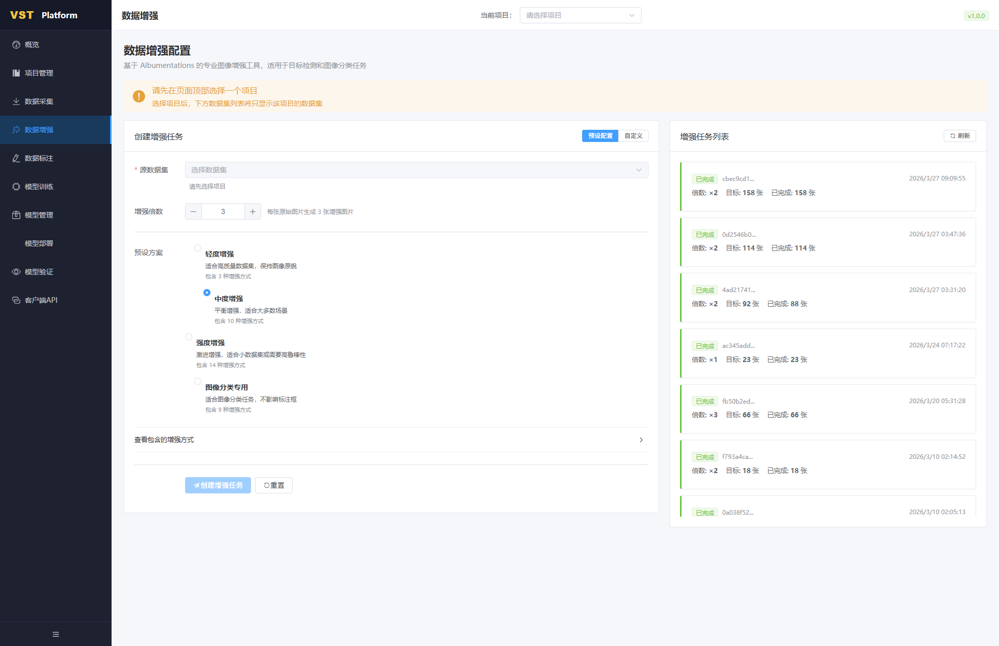
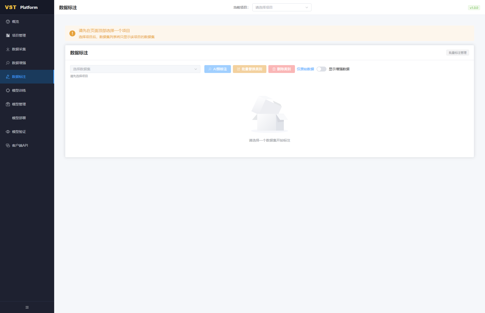
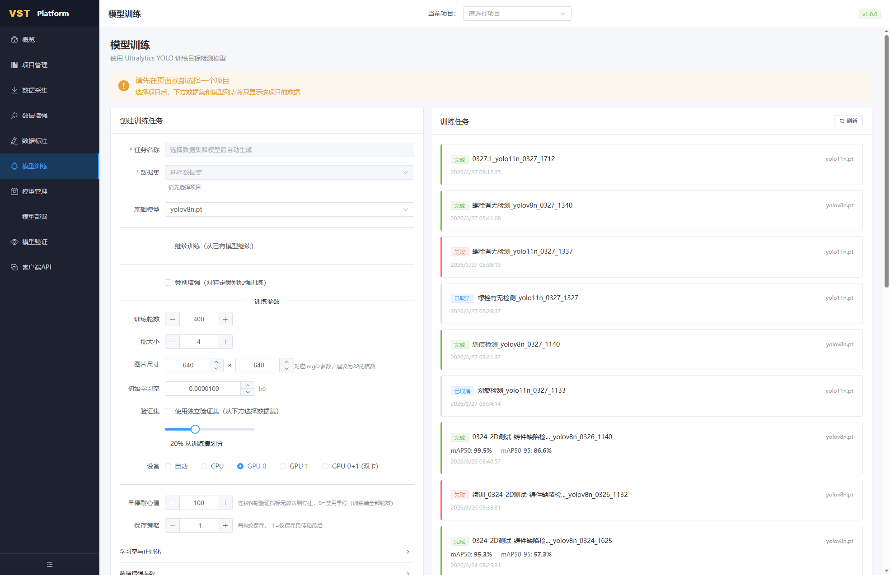
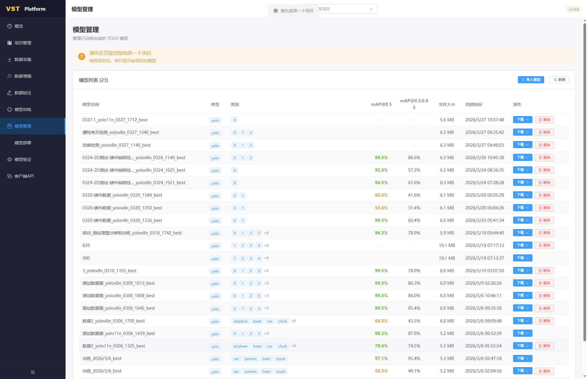
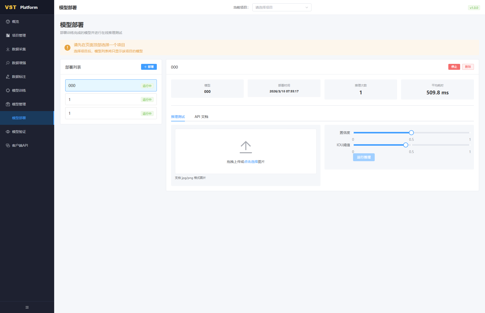
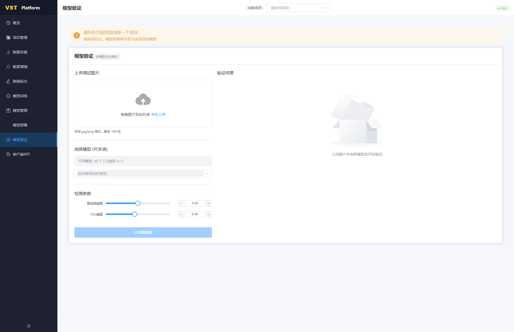
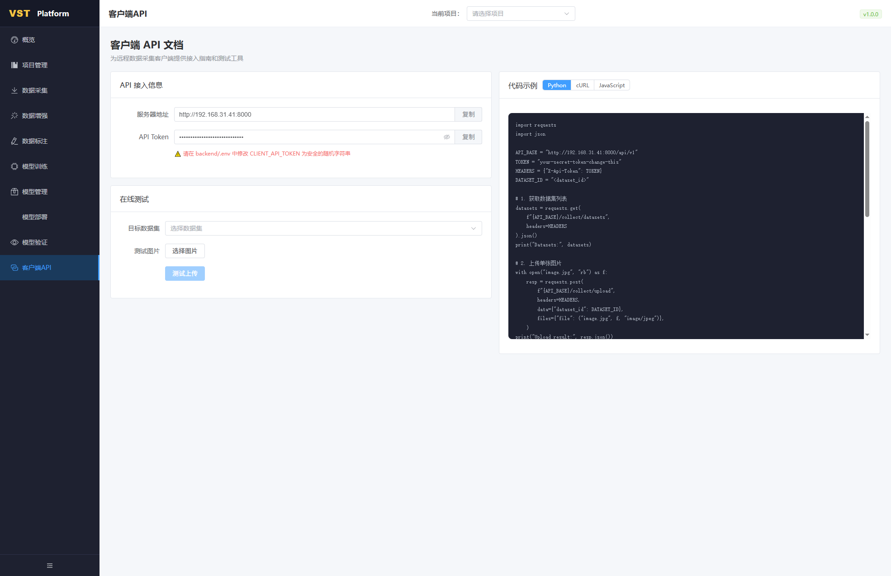

# VST Platform 操作手册

本文档说明 **VST 目标检测训练平台**（前端）的日常使用方式。界面以左侧导航 + 顶部「当前项目」为核心，多数功能需先选择项目后，列表才会按项目过滤。

**文档中的界面截图**在撰写时基于以下地址采集（部署到其他机器时请把主机与端口换成实际值）：

- 示例入口：`http://192.168.31.41:8000/dashboard`

---

## 1. 访问与浏览器要求

1. 在浏览器地址栏输入平台地址，根路径 `/` 会自动跳转到 **概览**（`/dashboard`）。
2. 建议使用 **Chrome / Edge** 等现代浏览器；内网部署时请确保本机与服务器网络互通。
3. 页面右上角显示版本号（如 `v1.0.0`），便于确认当前前端构建版本。

---

## 2. 全局布局

### 2.1 左侧导航

从左栏可进入各功能模块（名称以界面为准）：

| 菜单       | 路径（相对站点根） | 说明           |
|------------|--------------------|----------------|
| 概览       | `/dashboard`       | 系统与任务总览 |
| 项目管理   | `/projects`        | 项目 CRUD、归档 |
| 数据采集   | `/collect`         | 上传、URL、远程推送 |
| 数据增强   | `/augmentation`    | Albumentations 增强任务 |
| 数据标注   | `/annotation`      | 目标检测标注 |
| 模型训练   | `/training`        | Ultralytics YOLO 训练 |
| 模型管理   | `/models`          | 已训练模型列表、下载、导入 |
| 模型部署   | `/deployments`     | 在线推理与 API |
| 模型验证   | `/validation`      | 多模型对比测试 |
| 客户端 API | `/client-api`      | Token、示例代码、联调 |

左下角可 **折叠/展开**侧栏，便于小屏查看。

### 2.2 顶部「当前项目」

- 多数页面在顶部提供 **当前项目** 下拉框。
- **请先选择项目**：选择后，该页的数据集/模型等列表通常只显示 **当前项目** 下的资源（各页会有黄色提示条说明）。
- 未建项目时，可先到 **项目管理** 创建项目。

### 2.3 概览页

概览展示 **数据集数、图片数、增强任务数、训练任务数** 等统计；**GPU 信息**、**磁盘容量**（若后端返回）；**快速操作** 跳转采集/增强/训练/项目；**最近训练任务** 可点击进入训练详情。

---

## 3. 项目管理

1. 点击 **新建项目** 创建项目，填写名称与描述（可选）。
2. 使用 **搜索框** 按名称或描述筛选；用 **全部 / 活跃 / 已归档** 切换状态。
3. 项目卡片上可查看 **数据集数量、模型数量**、状态标签与日期。
4. 卡片上 **数据集 / 模型** 等快捷入口可进入对应流程（会关联到该项目）。

---

## 4. 数据采集

**前提**：在顶部选择 **当前项目**；目标数据集列表仅显示该项目下的数据集。

支持多种方式（以页内标签为准）：

- **本地文件上传**：选择目标数据集（可 **新建数据集**），将图片拖到上传区或点击上传；支持常见图片格式，注意单次张数上限提示。
- **带标签上传**：按页面说明上传 YOLO 格式（`images` + `labels` 等），文件名需对应。
- **URL 批量采集**：按提示填写图片 URL 列表。
- **客户端远程推送**：需使用 **X-Api-Token**；详见 **客户端 API** 页。

---

## 5. 数据增强

1. 选择 **当前项目** 与 **源数据集**。
2. 设置 **增强倍数**（每张原图生成多少张增强图）。
3. 选择 **预设配置** 或 **自定义**；预设一般包含轻度/中度/强度/分类等方案，可展开查看包含的增强方式。
4. 点击 **创建增强任务**；右侧 **增强任务列表** 可查看进度与状态，必要时 **刷新**。

---

## 6. 数据标注

1. 选择 **当前项目**，再选择 **数据集**。
2. 进入标注画布后，按工具栏进行框选、改类名等操作（具体快捷键以页面为准）。
3. 可使用 **AI 预标注**、**批量替换类别**、**删除类别** 等（部分按钮在未选数据集时不可用）。
4. 可按需切换 **仅原始数据**、**显示增强数据** 等选项；**批量标注管理** 用于批量流程。

---

## 7. 模型训练

1. **必须**先在顶部选择 **当前项目**，否则数据集下拉可能不可用或提示「请先选择项目」。
2. 填写或确认 **任务名称**（可在选择数据集与基础模型后自动生成，也可手改）。
3. 选择 **数据集**、**基础模型**（如 YOLOv8 / YOLO11 各尺寸 `.pt`）。
4. 按需勾选 **继续训练**、**类别增强** 等。
5. 在 **训练参数** 中设置轮数、批大小、输入尺寸、学习率、验证集划分比例、**设备**（CPU / 指定 GPU / 多卡）等。
6. 展开 **学习率与正则化**、**数据增强参数**、**损失权重**、**高级参数** 可做细调。
7. 点击 **开始训练**；下方 **训练任务** 列表显示状态（进行中、完成、失败、已取消等），可点进 **训练详情** 查看曲线与日志。

---

## 8. 模型管理

1. 选择 **当前项目** 后，列表仅显示该项目模型。
2. 表格中可查看 **类型、类别、mAP、文件大小、创建时间** 等。
3. **下载**：导出权重等文件；**删除**：移除记录（请确认无部署依赖）。
4. **导入模型**：将外部训练好的符合要求的模型导入到平台。

---

## 9. 模型部署

1. 选择 **当前项目**，在 **部署列表** 中查看已有部署或点击 **部署** 新建。
2. 选中一条部署后，可查看 **推理次数、平均耗时** 等；必要时 **停止** 或 **删除**。
3. **推理测试** 页：上传图片，调节 **置信度、IOU**，点击 **运行推理** 查看效果。
4. **API 文档** 页：查看 HTTP 调用方式，便于业务集成。

---

## 10. 模型验证

用于 **多模型对比**：上传测试图（支持多张，有数量与格式说明），**多选模型**，设置 **置信度、IOU**，点击 **开始验证**，在右侧 **验证结果** 中对比输出。

---

## 11. 客户端 API

1. 页面展示 **服务器地址**、**API Token**（请复制使用），勿将 Token 提交到公开仓库。
2. 生产环境请在服务端将 `CLIENT_API_TOKEN` 配置为强随机字符串（见后端 `.env` 说明）。
3. **在线测试**：选择 **目标数据集**、测试图片后 **测试上传**，确认链路正常。
4. **代码示例** 支持 **Python / cURL / JavaScript**，请求需带 **`X-Api-Token`** 请求头；示例中的 `API_BASE`、`dataset_id` 请按实际环境替换。

---

## 12. 常见问题（简要）

| 现象 | 建议 |
|------|------|
| 下拉框无数据或禁用 | 先在顶部选择 **当前项目** |
| 训练找不到数据集 | 确认数据集属于当前项目且已具备标注等训练前置条件 |
| 远程推送失败 | 检查 Token、网络、目标数据集 ID 与接口路径 |
| GPU 不显示或不可用 | 查看概览 GPU 信息；训练页设备选择与服务器 CUDA 环境 |

---

## 13. 截图清单

| 文件 | 内容 |
|------|------|
| `screenshots/01-dashboard.png` | 概览 |
| `screenshots/02-projects.png` | 项目管理 |
| `screenshots/03-training.png` | 模型训练 |
| `screenshots/04-models.png` | 模型管理 |
| `screenshots/05-annotation.png` | 数据标注 |
| `screenshots/06-collect.png` | 数据采集 |
| `screenshots/07-augmentation.png` | 数据增强 |
| `screenshots/08-deployments.png` | 模型部署 |
| `screenshots/09-validation.png` | 模型验证 |
| `screenshots/10-client-api.png` | 客户端 API |

---

*若部署地址或界面文案有变更，请以实际环境为准，并酌情更新本文档与截图。*
